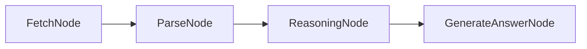

## Eixo 3: Arquitetura e Modelagem 

Esta sessão apresenta a auditoria do Eixo 3 - Arquitetura e Modelagem do Scrapegraph-ai com base nos modelos de qualidade MPS.BR (PJR) e CMMI (TS).

## 1. Visão Geral da Arquitetura em Camadas

O ScrapeGraphAI implementa uma arquitetura em camadas e uma topologia orquestrada por um Grafo Acíclico Direcionado (DAG). O sistema separa suas responsabilidades de forma clara:

* **Interface/Orquestração (`scrapegraphai/graphs/`):** Atua como o controlador principal. A classe abstrata `AbstractGraph` (`abstract_graph.py`) define o contrato base. A classe concreta `BaseGraph` implementa o motor de execução que gerencia o fluxo. Grafos especializados (ex: `SmartScraperGraph`, `SearchGraph`) herdam as diretrizes iniciais e montam o pipeline.
* **Lógica de Negócio e Processamento (`scrapegraphai/nodes/`):** Unidades lógicas que executam o trabalho real. Todas herdam da interface comum `BaseNode`. Exemplos incluem operações granulares de extração (`FetchNode`, `ParseNode`), geração guiada por IA (`GenerateAnswerNode`) e ramificações lógicas (`ConditionalNode`).
* **Infraestrutura e Integração IA (`scrapegraphai/models/`):** Camada que envelopa os modelos LLM e de Embedding. Fornece os *wrappers* de comunicação com provedores externos (OpenAI, Anthropic, Ollama, etc.) e serviços associados.

## 2. Análise de Padrões Arquiteturais

A maturidade do projeto evidencia-se na aplicação rigorosa de padrões de design para tráfego de dados e estruturação modular.

### A. Padrão Microkernel (Extensibilidade)
A topologia do framework é fundamentada no padrão Microkernel. 
* **O Núcleo Estável (Kernel):** A classe `BaseGraph` gerencia a execução central, a telemetria e o estado global.
* **Os Plugins:** Os `Nodes` operam como componentes independentes e estruturalmente desacoplados.
É possível expandir o fluxo através de métodos como `graph.append_node(custom_node)`, sem a necessidade de alteração do motor principal.
Exemplo: `graph.append_node(custom_node)  # Adiciona nó ao final do pipeline`



#### Blackboard (Estado Compartilhado)
Para o tráfego de dados e comunicação entre as camadas, o sistema descarta o acoplamento por passagem direta de parâmetros. A orquestração baseia-se em um dicionário central mutável (o `state`), onde cada nó declara formalmente seus contratos de entrada e saída. Sob uma perspectiva matemática, a execução do grafo traduz-se em uma sucessão de transformações de estado.

### B. Padrão Strategy
Para mitigar o risco de dependência de fornecedor (*Vendor Lock-in*), o projeto isola as chamadas de API externas utilizando o padrão Strategy e o ecossistema LangChain como uma camada de abstração. Por meio de *Duck Typing*, o sistema viabiliza o polimorfismo em tempo de execução visível no método `AbstractGraph._create_llm()`

```python
# Abstração da seleção de provedor via Strategy
if provider == "openai":  
    return ChatOpenAI(model=model)  
elif provider == "anthropic":  
    return ChatAnthropic(model=model)  
elif provider == "ollama":  
    return ChatOllama(model=model)
```

## 3. RAG e Integração de Dados
Devido aos limites de contexto dos LLMs, o sistema implementa *Retrieval-Augmented Generation* (RAG) nativamente através do RAGNode.
O `RAGNode` é o responsável por comprimir os tokens de entrada.
* **Fluxo de Execução:** O conteúdo raspado sofre *chunking* e é transformado em vetores através de modelos de *embedding*.
* **Banco de Vetores:** O projeto utiliza suporte nativo a bancos de dados vetoriais como Qdrant (memória, local ou Docker) e FAISS, garantindo que o contexto recuperado seja adicionado ao *prompt* para aumentar a precisão e reduzir alucinações.

## 4. Postura Fail-Fast
O orquestrador prioriza a rastreabilidade em detrimento da autorrecuperação autônoma infinita. Adotando uma postura Fail-Fast, o sistema interrompe a execução do grafo em caso de formatação inadequada da IA ou timeouts. Antes de propagar a falha, o estado exato é capturado. Logs são enriquecidos com metadados críticos: tempo de execução, consumo de tokens via callbacks e a assinatura do nó causador do erro, facilitando a auditoria.

```python
# scrapegraphai/graphs/base_graph.py._execute_standard()
except Exception as e:  
    error_node = current_node.node_name  
    log_graph_execution(  
        # ...
        error_node=error_node,  
        exception=str(e)  
    )  
    raise e  # Propaga erro, não tenta recuperação
```
